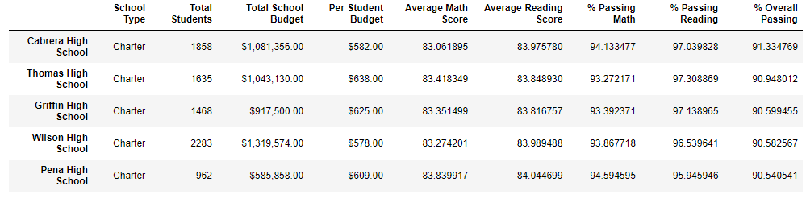
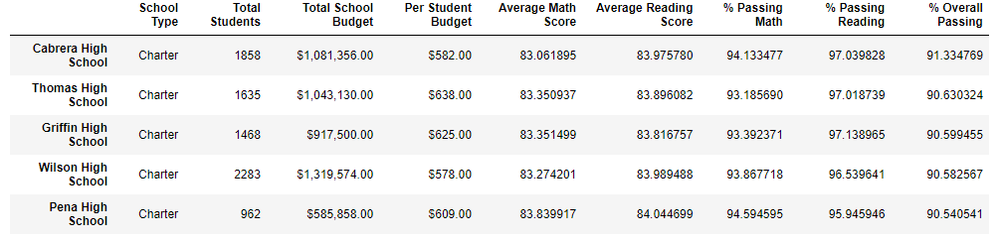
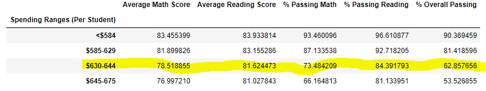
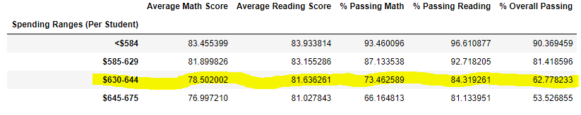
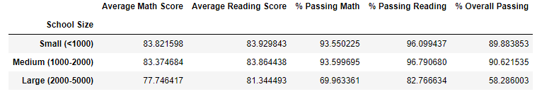
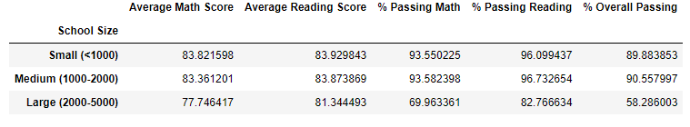
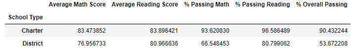
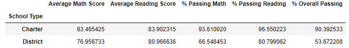
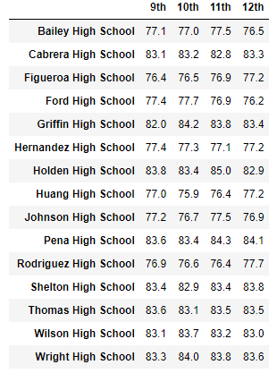
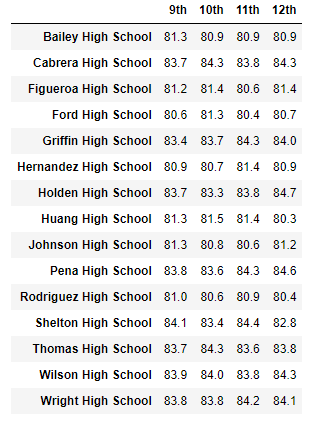

# School_District_Analysis

## Overview
For this project we were given access to every student's math and reading scores for 15 different schools in the same school district, including various information about those schools.  The purpose of this analysis was to analyze data on student funding and students standardized test scores.  The goal of this analysis was to aggregate the data and show trends in school performance related to the list of items below.
* Top 5 and bottom 5 performing schools based on the overall passing rate
* Average math score received by students in each grade level at each school
* Average reading score received by students in each grade level at each school
* School performance based on the budget per student
* School performance based on the school size
* School performance based on the type of school

One imnportant aspect of this analysis that had to be taken into consideration was that the math and reading scores for 9th grade students at Thomas High School had to be considered invalid due to apparent academic dishonesty.  This meant that the math and reading scores for 9th grade students at Thomas High School were not included in the school district analysis.

## Results
The school district analysis was first conducted using all of the student data and then analyzed again without the math and reading scores for 9th grade students at Thomas High School.  When we compare the results from both sets of data we can observe how the absence of the 9th grade math and reading scores from Thomas High School affect the overall data.  In the original analysis, Thomas High School ranked second out of all the schools in overall passing percentage with 90.9%.  When we run the analysis again without the Thomas High School 9th grade data, we see that the overall passing percentage dropped slightly to 90.6% but this did not change their overall ranking of second.
 

Replacing the 9th grade scores for Thomas High School has no effect on the math and reading scores for other grades or for other schools besides Thomas High School.  For the purposes of our analysis in regards to the per student budget, Thomas High School is classified in the $630-$644 range so we only need to look at this cohort when analyzing the effect of not including the 9th grade math and reading scores from Thomas High School.  When we compare scores by school spending with and without the Thomas High School 9th grade data we observe that the data is slightly different, but if we round the data to the nearest tenth of a percent, there is no difference and thus no affect on the data.
 

Again, for the purposes of our analysis in regards to the scores by school size, Thomas High School is classified in the "Medium" size range (1000-2000 students) so we only need to look at this cohort when analyzing the effect of not including the 9th grade math and reading scores from Thomas High School.  When we compare scores by school size with and without the Thomas High School 9th grade data we observe again, similar to the per student budget, that the data is slightly different but if we round the data to the nearest tenth of a percent, there is no difference and thus no affect on the data.
 

Finally, for the purposes of our analysis in regards to the scores by school type, Thomas High School is a Charter school so we only need to look at this cohort when analyzing the effect of not including the 9th grade math and reading scores from Thomas High School.  Again, when we compare scores by school type with and without the Thomas High School 9th grade data we observe that if we round the data to the nearest tenth of a percent, there is no difference and thus no affect on the data.
 

## Summary
We compared the data with and without the math and reading scores for Thomas High School 9th graders in regards to scores by grade, school spending, school size and school type and the results of that comparison are not particularly compelling.  While we do observe a slight variation in the data when compared side-by-side, the affect of not including the math and reading scores from Thomas High School 9th graders on the overall data was insignificant.  Because the overall affect on the data was so minimal, we can infer that the reason that removing the math and reading scores for Thomas High School 9th graders from our analysis was insignificant is because the scores of the 9th graders at Thomas High School was relatively consistent with the scores from the 10th-12th graders at Thomas High School.  This inference is supported by the data when we analyze the math and reading scores respectively by grade for each school.
 

